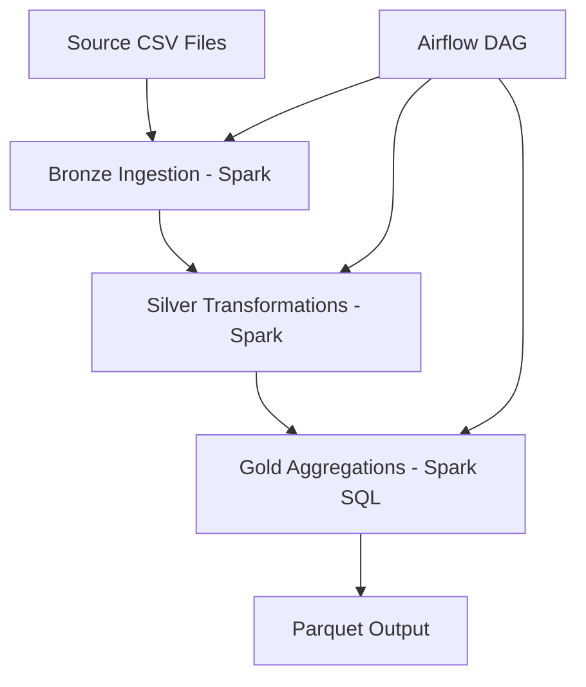

# End-to-End Data Engineering Pipeline (Spark + Airflow)

## Overview
This repository contains a **production-style batch data engineering pipeline** built to demonstrate the core skills expected of a **Data Engineer I / II**.

The project ingests raw CSV data, validates and transforms it using **PySpark**, writes optimized **Parquet** datasets, and orchestrates the entire workflow using **Apache Airflow**.

All data used was synthetically generated using python Fake — no proprietary or employer-related data.

---

## 🎯 Why This Project

This project was intentionally designed to mirror real-world data engineering work:

- Build **repeatable, idempotent pipelines**
- Separate raw, transformed, and analytics-ready data
- Use Spark for scalable processing
- Use Airflow for orchestration and dependency management
- Write clean, readable, interview-friendly code

This single project is meant to serve as a **flagship portfolio example**.

---

## 🧰 Tech Stack

- **Language:** Python
- **Processing:** Apache Spark (PySpark, Spark SQL)
- **Orchestration:** Apache Airflow
- **Storage:** Local filesystem (cloud-ready design)
- **Formats:** CSV → Parquet
- **Version Control:** Git

---

## 🗂️ Data Architecture (Medallion Pattern)

```
Raw (Bronze)
   ↓
Staged / Cleaned (Silver)
   ↓
Analytics-Ready (Gold)
```

- **Bronze:** Raw CSV ingestion, schema enforcement
- **Silver:** Cleansed, typed, validated datasets
- **Gold:** Aggregated datasets optimized for analytics

---

## 🏗️ Pipeline Architecture (Mermaid)



---

## 🔄 Workflow Steps

1. **Ingest Raw Data**  
   - Read CSV files
   - Enforce schema
   - Write raw Parquet

2. **Transform & Clean**  
   - Cast data types
   - Handle nulls and invalid records
   - Apply business logic

3. **Aggregate**  
   - Grouping and summarization
   - Create analytics-ready datasets

4. **Orchestrate**  
   - Airflow DAG defines task order
   - Each Spark job is independently runnable

---

## ⏱️ Airflow DAG Design

```text
start
  ↓
ingest_bronze
  ↓
transform_silver
  ↓
aggregate_gold
  ↓
end
```

**Key Design Points:**
- Tasks are **idempotent**
- Failures are isolated per stage
- Clear task boundaries for observability

---

## 📁 Repository Structure

```
.
├── dags/
│   └── data_pipeline_dag.py
├── jobs/
│   ├── ingest_bronze.py
│   ├── transform_silver.py
│   └── aggregate_gold.py
├── data/
│   ├── raw/
│   ├── bronze/
│   ├── silver/
│   └── gold/
├── utils/
│   └── spark_session.py
├── requirements.txt
└── README.md
```

---

## ▶️ How to Run Locally

```bash
# I installed the following locally on my ThinkPad P14 Gen 6 AMD running Fedora 43
mkdir $HOME/airflow
cd $HOME/airflow

# I had issues running python 3.14 with Airflow 3.x so had to use 3.11.
virtualenv --python=/usr/bin/python3.11 .venv
source .venv/bin/activate

# Reference the python 3.13 constraints even though 3.11 will be used.
pip3 install apache-airflow==3.1.2 --constraint https://raw.githubusercontent.com/apache/airflow/constraints-3.1.2/constraints-3.13.txt
pip3 install pyspark

# You want to put this is your .bash_profile
export AIRFLOW_HOME=$HOME/airflow

# Start Airflow (simplified)
airflow standalone

# Airflow UI - Open Web Broswer
http://localhost:8080/home

# Command Line Trigger DAG
airflow dags trigger data_pipeline_dag
```

> Spark jobs can also be run independently using `spark-submit`.

---

## 🧠 What This Demonstrates (Data Engineer I / II)

- Writing Spark jobs for ETL workloads
- Designing batch pipelines end to end
- Using Airflow for orchestration
- Data modeling and aggregation logic
- Clean repo structure and documentation
- Production-aware thinking (even when running locally)

---

## 🚀 Recommended Portfolio Scope

For a strong Data Engineer I / II portfolio, **2–3 projects are enough**:

1. **This flagship Spark + Airflow pipeline** (core requirement)
2. One **SQL / analytics-focused project** (data modeling, reporting)
3. *(Optional)* One **Python utilities or data quality project**

Hiring managers prefer **depth over volume** — one well-documented pipeline like this is far more valuable than many shallow projects.

---

## 📫 Contact

- **GitHub:** https://github.com/your-username
- **LinkedIn:** https://www.linkedin.com/in/your-profile

---

⭐ This project is intentionally scoped, readable, and practical — designed to reflect how data engineering work is done in real teams.
